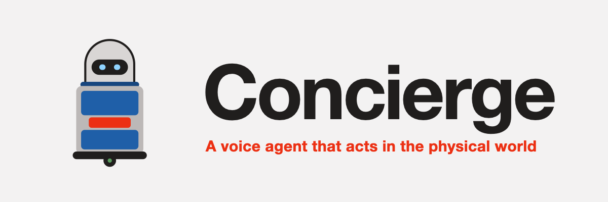

<p align="center">
  
</p>

<p align="center"><b>A voice agent that acts in the physical world.</b><br>
Phone the hotel front desk, ask for towels, and watch a simulated delivery robot bring them to your room.</p>

<p align="center">Built for the <b>AssemblyAI Voice Agent Hackathon</b> on <a href="https://lablab.ai">lablab.ai</a> (September 2026).</p>

---

## Why

Most of what a hotel front desk hears all day is routine: *can I get two more
towels*, *do you have a toothbrush*, *what time is checkout*, *my Uber Eats
order is downstairs*. Each call pulls a person away from the guest standing
in front of them, and many of those calls come in a language the staff on
shift may not speak.

Hotels already run delivery robots for exactly these errands. But today a
person still answers the phone, writes the request down, loads the robot and
types the room number into its screen. The robot is automated; getting the
request *to* the robot is not.

Concierge closes that gap. The guest calls the front desk and talks normally.
A voice agent understands the request, checks the live menu and stock, and
dispatches the robot. Staff only do the one thing a robot can't: put the
items in the bin. Everything else is on the dashboard: where the robot is,
what was said, what each call did, and what still needs a human.

**The problems it takes on:**

- **Routine requests eat staff time.** Amenities, deliveries, policy
  questions and food-app pickups are handled end to end by voice.
- **Guests speak many languages.** A guest can ask in Mandarin or mix
  languages mid-sentence; the order still comes out right.
- **Promises must match reality.** The agent answers from the real menu,
  stock and hotel policy, never from a guess, and it never says "on the way"
  before the robot has actually left.
- **Some things need a person.** Late checkout, a broken AC, a lost key card
  are escalated to the front-desk queue as requests, not invented answers.
- **Riders can't go upstairs.** A delivery-app order left at the desk is
  booked onto the robot, in the same trip as anything else for that room.

## Why AssemblyAI

The whole experience lives or dies on the phone call feeling natural, and
that is where the [AssemblyAI Voice Agent API](https://www.assemblyai.com/docs)
carries the project:

- **One WebSocket for the whole call.** Speech recognition, turn detection,
  the LLM and speech synthesis run as one real-time session. There's no
  speech-to-text, LLM and text-to-speech pipeline to glue together, and no
  hop between services on every turn.
- **Speech-to-text built for real calls.** Room numbers, item names and
  mixed-language requests come through accurately, and **keyterm prompting**
  biases recognition toward the words that matter on this call: the
  guest's own room number, *conditioner*, *char kuey teow*, *Uber Eats*.
- **Turn detection you can tune.** A guest who pauses mid-thought
  ("Oh yeah, I also wanted to ask…") is not cut off. Silence thresholds and
  VAD sensitivity are tuned for a noisy hotel room.
- **Barge-in.** A guest can interrupt the agent, and an `interruption_delay`
  keeps a cough or a background voice from cutting a reply short.
- **Client-side tools.** The agent calls functions that run in our own
  process, against live state: the robot's position, the task queue, the
  stock. In `hold` mode a tool result goes straight back and the spoken
  answer follows immediately.
- **Bring your own LLM.** A stored agent routes to any
  OpenAI-compatible model (here via OpenRouter), so the model is chosen for
  reliable tool calling and latency, not fixed by the platform.
- **Browser-ready.** A short-lived token lets the hosted demo connect straight
  from the visitor's browser, with the session length capped by the server,
  so the API key never leaves the backend.

## What it does

| Tool | What the agent uses it for |
|---|---|
| `check_menu` | Price, dietary tags and availability of an item |
| `dispatch_delivery` | Send the robot to a room; unavailable items are reported, not sent |
| `deliver_parcel` | Carry up a delivery-app order left at the desk (joins a waiting trip) |
| `check_delivery_status` | Where the guest's order is and its ETA |
| `amend_delivery` | Add or remove items, or change the room, mid-flight |
| `recall_robot` | Call the robot back to the desk |
| `get_fleet_state` | Every robot's phase, task and battery |
| `announce_arrival` | Mark a delivery as announced at the door |
| `hotel_info` | Check-in/out, late checkout fees, facilities, Wi-Fi, breakfast, parking |
| `escalate_to_frontdesk` | Hand a request to a human (late checkout, a complaint, a broken item) |
| `end_call` | Hang up after the goodbye |

Every tool handler returns in under ~100 ms: it queues a command or reads
state, and never waits for the robot. Arrival and completion show up later,
in the robot's state and on the dashboard.

**The robot** is a custom differential-drive delivery cabinet in
[MuJoCo](https://mujoco.org) (`sim/delivery_bot_v2.xml`), with a two-panel
sliding bin door. It drives an L-shaped hotel corridor with four rooms
(`sim/scene_corridor.xml`) by pure pursuit over hand-authored waypoints. A
delivery runs: **load at the desk** (the camera cuts to the counter, the bin
opens, and staff press *Bin loaded*) → **drive to the room** → **hand-over**
(the room door swings open, the bin opens, the guest collects) → **drive
home and park**. It can be recalled at any point.

**The dashboard** (`dashboard/`, Next.js) shows the live call as it happens,
the fleet, every delivery, the full call log (transcript, tool calls and
their results), escalations, and editable inventory, all live from
Supabase.

## Architecture

```
 guest ── voice ──►  AssemblyAI Voice Agent API  (STT · turn detection · LLM via OpenRouter · TTS)
                              │  tool.call / tool.result
                              ▼
        ┌─────────────────────────────────┐        ┌───────────────────────────────┐
        │ Orchestrator (asyncio)          │ queue  │ Task engine + MuJoCo physics  │
        │ holds the WebSocket, runs tools │ ─────► │ FSM per task, pure pursuit,   │
        │ in <100 ms, never runs physics  │ ◄───── │ loading / hand-over scenes    │
        └───────────────┬─────────────────┘  state └───────────────┬───────────────┘
                        │                                          │
                        └──────────────► Supabase ◄────────────────┘
                                  (menu, stock, deliveries, robots,
                                   call log, escalations) ──► Dashboard
```

The one hard rule is that physics never runs on the thread that holds the
voice connection. Locally that means separate processes; in the browser, a
Web Worker.

There are two ways to run it:

| | Local (the recorded demo) | Hosted web demo (`/demo`) |
|---|---|---|
| Voice | Python agent, laptop mic and speaker | The visitor's browser (AudioWorklet, echo cancellation) |
| Tools | `orchestrator/tools.py` | `dashboard/lib/voice/tools.ts` (same behaviour) |
| Robot | `task_engine/` + MuJoCo, two robots, native viewer | Same engine ported to TypeScript, MuJoCo WASM in a Web Worker, three.js view |
| Secrets | Repo-root `.env` | Next.js route handlers only (`/api/call/start`, `/api/call/event`) |

Both share the same prompt, tools, hotel facts and turn-taking settings
(`scripts/export_agent_config.py` copies them from Python to the web app),
and write to the same Supabase, so web calls appear in the same call log.

## Running it

### Prerequisites

- Python 3.10+ and Node.js 22.18+ (macOS for the native MuJoCo viewer)
- An [AssemblyAI](https://www.assemblyai.com) API key (Voice Agent API)
- An [OpenRouter](https://openrouter.ai) API key
- A [Supabase](https://supabase.com) project

### 1. Configure

```bash
git clone https://github.com/johnnytan5/Concierge.git && cd Concierge
cp .env.example .env                 # fill in the keys
```

Create `dashboard/.env.local` with the public values (the block at the end of
`.env.example`). **Use the Supabase anon key there, never the service-role
key.**

### 2. Database

Apply the schema and seed data in `supabase/migrations/` to your project:

```bash
supabase link --project-ref <your-project-ref>
supabase db push
```

### 3. Install

```bash
python -m venv .venv
.venv/bin/pip install -r requirements.txt
cd dashboard && npm install && cd ..
```

### 4. Run the local stack

```bash
.venv/bin/uvicorn admin_api.main:app --port 8000     # terminal 1: admin API
cd dashboard && npm run dev                           # terminal 2: http://localhost:3000
```

Open the dashboard, go to **Live call**, pick the room the guest is calling
from and press **Answer call**. Then talk into the mic. A MuJoCo window opens
on the robot doing the delivery; press **Bin loaded** on the Fleet tab when
the bin is open at the desk.

Or skip the dashboard and call directly from a terminal:

```bash
.venv/bin/python -m orchestrator.agent --room 1204 --viewer
```

### 5. Run the web demo

With `npm run dev` running, open **http://localhost:3000/demo**. The admin UI
is on the left and the live robot on the right. Press **Call the front desk**
and allow the microphone. No Python needed.

### Deploy the web demo (Vercel)

1. Import the repo on Vercel and set **Root Directory** to `dashboard`.
2. Add environment variables:

   | Name | Value |
   |---|---|
   | `NEXT_PUBLIC_DEMO_MODE` | `1` (admin write buttons become read-only) |
   | `NEXT_PUBLIC_SUPABASE_URL`, `NEXT_PUBLIC_SUPABASE_ANON_KEY` | as in `dashboard/.env.local` |
   | `SUPABASE_URL`, `SUPABASE_SERVICE_ROLE_KEY` | server-only |
   | `ASSEMBLYAI_API_KEY`, `OPENROUTER_API_KEY` | server-only |
   | `DEMO_DAILY_CALL_LIMIT` | optional, default `100` |

3. Deploy and open `https://<project>.vercel.app/demo`.

The page is open to anyone, so each call is capped at 3 minutes. Each visitor
(by IP, with a browser id and fingerprint as backup) gets 3 calls or 9
minutes per day, plus a global daily cap.

## Checks

```bash
cd dashboard
npm run selfcheck:engine    # robot engine vs. the Python scenarios, real MuJoCo in Node
npm run selfcheck:tools     # tool handlers, nudges and rate limits
BASE=http://localhost:3000 npm run e2e:call   # one real, scripted spoken call (macOS `say`)

cd ..
.venv/bin/python -m orchestrator.tools   # tool handler self-check
.venv/bin/python -m task_engine.engine   # engine self-check on the real corridor scene
```

## Repository layout

```
orchestrator/   voice agent: AssemblyAI session, prompt, tool handlers, inventory, hotel facts
task_engine/    delivery FSM, pure-pursuit navigation, per-room waypoints, Supabase mirroring
sim/            MuJoCo robot and corridor scene, simulator wrapper, viewer scripts
admin_api/      FastAPI: start/stop calls, admin writes (inventory, recall, escalations)
dashboard/      Next.js admin UI, the /demo web version, API routes, browser engine port
supabase/       schema and seed migrations
scripts/        demo-data seeding, Python → web agent-config export
brand/          logo and icon
```

## License

[MIT](LICENSE)
